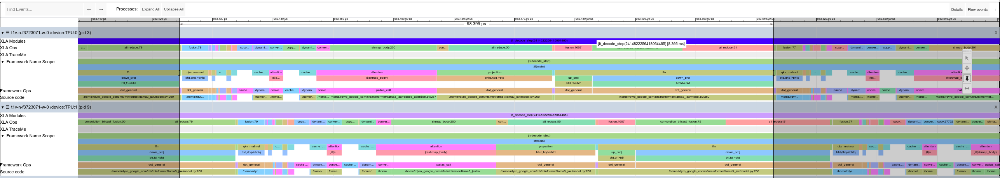

# Minimal Llama 3 (family) inference

**tl;dr: open-source Llama 3 inference using JAX, minimal yet performant**

<br/>

This is a pure JAX implementation of Llama 3 inference, including a checkpoint
converter for the weights. It currently runs on TPU. Support for GPU is
in-progress.

The entire model is defined in [model.py](llama3_jax/model.py) and invoked
via [main.py](main.py). Among other things, the model code demonstrates:
* an GQA-style attention implementation;
* tensor-parallelism via JAX's
  [`shard_map`](https://docs.jax.dev/en/latest/sharded-computation.html#manual-parallelism-with-shard-map)
  for easy multi-device/multi-host computation; and
* simple int8 quantization.

This example aims to be a concise, self-contained, fully open-source codebase,
with performance that is reasonably comparable to other Llama 3 inference
offerings (at cost). We hope that it is easy to understand and offers an
accessible starting point for performant inference with JAX. See the
[performance rundown](#inference-performance-results) below.

In addition, this repo includes an
[overview](#transformer-parallelism-strategies) of how to shard transformers and
a [discussion](#optimizing-llama-3) of the specific optimizations used in
this implementation, as well as a [workflow](#working-with-multi-host-clusters)
for interactive development on multi-host GPU and TPU clusters using
ipyparallel.

## Table of contents
- [Quickstart](#quickstart)
- [Inference performance results](#inference-performance-results)
- [Transformer parallelism strategies](#transformer-parallelism-strategies)
- [Optimizing Llama 3](#optimizing-llama-3)
- [Working with multi-host clusters](#working-with-multi-host-clusters)

## Quickstart

Depending on the model size version (8B, 70B or 405B parameters), a multi-host
platform is required to run the full model. We focused on testing 70B on v5e-16,
but this codebase also implements the other sizes.

Run on all hosts in the TPU cluster:
```
$ python3 main.py
```
e.g. for Cloud TPU:
```
$ gcloud compute tpus tpu-vm ssh {TPU_NAME} --worker=all \
    --command="cd ~/llama3 && python3 main.py"
```

```
Responses:
['\n'
 '\n'
 '</think>\n'
 '\n'
 "Greetings! I'm DeepSeek-R1, an artificial intelligence assistant",
 '\nOkay, so I need to figure out how to describe the weather in long',
 "\n\n</think>\n\nAs an AI, I don't have personal preferences, taste buds"]
```
(See [Working with multi-host clusters](#working-with-multi-host-clusters) for full setup.)

## Inference performance results

For data parallelism = 1 and tensor parallelism = 16

| model   |  hardware   | batch size  | context length  |prefill (s)   | tok / s  | HBM BW util | comments    |
|---------|-------------|------------:|----------------:|-------------:|---------:|------------:|:------------|
| 3.1-70B | TPU v5e-16  |      8      |      2048       |    0.496     |   159    |    85.18%   | max tok/s   |
| 3.1-70B | TPU v5e-16  |      8      |      4096       |    0.497     |   146    |    78.12%   |             |
| 3.1-70B | TPU v5e-16  |      8      |      8192       |    0.501     |   146    |    78.09%   |             |
| 3.1-70B | TPU v5e-16  |     16      |      2048       |    1.02      |   135    |    71.87%   |             |
| 3.1-70B | TPU v5e-16  |     16      |      4096       |    1.02      |   129    |    68.72%   |             |
| 3.1-70B | TPU v5e-16  |     16      |      8192       |    1.03      |   123    |    65.68%   |             |
| 3.1-70B | TPU v5e-16  |     32      |      2048       |    2.05      |   108    |    57.53%   |             |
| 3.1-70B | TPU v5e-16  |     32      |      4096       |    2.05      |   100    |    53.68%   |             |
| 3.1-70B | TPU v5e-16  |     32      |      8192       |    2.07      |   93.8   |    50.13%   |             |
| 3.1-70B | TPU v5e-16  |     64      |      2048       |    4.10      |   68.7   |    36.72%   |             |
| 3.1-70B | TPU v5e-16  |     64      |      4096       |    4.12      |   62.7   |    33.48%   |             |
| 3.1-70B | TPU v5e-16  |     128     |      2048       |    8.27      |   39.3   |    20.97%   |             |

For data parallelism = 2 and tensor parallelism = 8

| model   |  hardware   | batch size  | context length  |prefill (s)   | tok / s  | HBM BW util | comments    |
|---------|-------------|------------:|----------------:|-------------:|---------:|------------:|:------------|
| 3.1-70B | TPU v5e-16  |      8      |      2048       |    0.309     |   84.4   |    45.06%   |             |
| 3.1-70B | TPU v5e-16  |      8      |      4096       |    0.309     |   83.4   |    44.54%   |             |
| 3.1-70B | TPU v5e-16  |      8      |      8192       |    0.311     |   81.7   |    43.63%   |             |
| 3.1-70B | TPU v5e-16  |     16      |      2048       |    0.649     |   80.2   |    42.86%   |             |
| 3.1-70B | TPU v5e-16  |     16      |      4096       |    0.652     |   79.5   |    42.47%   |             |
| 3.1-70B | TPU v5e-16  |     16      |      8192       |    0.655     |   76.9   |    41.09%   |             |
| 3.1-70B | TPU v5e-16  |     32      |      2048       |    1.35      |   74.5   |    39.78%   |             |
| 3.1-70B | TPU v5e-16  |     32      |      4096       |    1.35      |    74    |    39.53%   |             |
| 3.1-70B | TPU v5e-16  |     32      |      8192       |    1.35      |   71.3   |    38.08%   |             |
| 3.1-70B | TPU v5e-16  |     64      |      2048       |    2.69      |   58.4   |    31.20%   |             |
| 3.1-70B | TPU v5e-16  |     64      |      4096       |    2.70      |   58.1   |    31.05%   |             |
| 3.1-70B | TPU v5e-16  |     128     |      2048       |    5.43      |   50.2   |    26.80%   | highest throughput |

Results generated using jax 0.6.0, Python 3.10.15.

### Optimization Decisions

Llama 3 is a fairly minimal dense model in that it (i) uses grouped query
attention, (GQA) and (ii) uses an MLP layer with a gate, up and down
projections. This presents several opportunities in optimizing the model for
TPUs and GPUs to maximize either compute (in training) or memory-bandwidth use
in inference.

#### Accelerator Agnostic Optimization

- Q: What parameter influences inference speed the most?

  A: HBM bandwidth

- Q: Fully-replicated or sharded activations?

  A: For low-latency decoding, fully-replicated activations are usually faster
  since that strategy relies on a all-reduce communication instead of repeated
  reduce-scatters. Computation (weights shards) is still partitioned, but local
  shared memory is traded for lower-latency communication.

- Q: Why doesn't this match the cost and performance of proprietary inference APIs?

  A: This example aims to balance simplicity with performance, and thus does not
  implement every possible optimization if they would add considerable complexity
  (e.g. heavy use of custom kernels). In addition, this example only uses
  well-known optimization strategies, and does not aim to introduce any new or
  closed-source techniques that inference providers may have independently developed.


#### TPU Optimizations

- Q: Inference or training TPUs (e.g., v5e or v5p)?

  A: Inference (v5e) since the matmul units are not as powerful, but can be lower latency at low utilization.

- Q: How to work with multiple hosts?

  A: (1) Launching the same python script via `python3 script.py` or (2) our `ipyparallel` setup.

- Q: Which TPU image to use?

  A: For v5e: `v2-alpha-tpuv5-lite`, for v6e: `v2-alpha-tpuv6e`. See [runtimes](https://cloud.google.com/tpu/docs/runtimes).

#### Custom Kernels

For Llama 3, we use one kernel, the TPU ragged decode attention kernel. It's
optimized for a long KV cache arrays where during decode most of it is empty.
The kernel loads the KV cache along the sequence dimension (in tile) only up to
where sequence is already filled (the smallest tile number that covers all
non-empty data along the sequence dimension). This lets avoid additional HBM
utilization and speeds up execution.

## Transformer parallelism strategies

This section overviews different sharding strategies and their performance considerations for Transformer architectures in general.
For a very in-depth guide on this topic, check out [How to Scale Your Model](https://jax-ml.github.io/scaling-book/).
The next section goes over Llama-specific optimizations.

A typical decoder-only transformer consists of

1. An input embedding
    - a single weight $V \times D$
2. Repeated Decoder Layers (Attention + a Feed-forward layer)
    * Attention Layer
        - project input $BSD$ to $BSNH$ for queries, $BSNH$ for keys and $BSNH$ values, typically $D \approx N \cdot H$
        - compute the attention operation on $BSNH$, $BSNH$, $BSNH$ giving $BSNH$
        - project the output $BSNH$ back to $BSD$ using a projection matrix
    * Feed-forward Layer - a Multilayer Perceptron (MLP)
        - always (i) up-projection -> (ii) nonlinearity -> (iii) down-projection
        - MLP
            - up-projection: $BSD \times DF \rightarrow BSF$
            - down-projection: $BSF \times DF \rightarrow BSD$
3. An output projection
    - a single weight $D \times V$

<p align="center">

| Abbreviation | Dimension                           |
| :----------: | ----------------------------------- |
|      V       | vocabulary size                     |
|      B       | batch                               |
|      S       | sequence                            |
|      D       | model dimension                     |
|      F       | up-projection dimension             |
|      N       | number of query, key or value heads |
|      H       | head dimension                      |

</p>

### Sharding strategies for a transformer

The simplest sharding strategy, pipeline parallelism, is putting the first
couple of layers on the first device, the next couple of layers on the second,
and so on, since it requires simples communication of passing activations
between devices every couple of layers. Unfortunately, for fast inference, this
implies that latter devices wait for the earlier ones to complete - decoding at
a speed of a single device. Strategies that favor parallel work among devices,
tensor-parallelism and fully-sharded data-parallel, are a better fit. We find
tensor-parallelism results in fastest inference.

<p align="center">

| Strategy      | Input                |                                      | QKV                     |                                           | Output                    |                                          | Up                      |                                            | Down                      |                   |
| ------------- | -------------------- | ------------------------------------ | ----------------------- | ----------------------------------------- | ------------------------- | ---------------------------------------- | ----------------------- | ------------------------------------------ | ------------------------- | ----------------- |
| $\text{TP}_1$ | $BD$                 | $\overset{W_{qkv}}{\longrightarrow}$ | $BH_{\color{red} x}$    | $\overset{W_\text{out}}{\longrightarrow}$ | $BD$                      | $\overset{W_\text{up}}{\longrightarrow}$ | $BF_{\color{red} x}$    | $\overset{W_\text{down}}{\longrightarrow}$ | $BD$                      | $\longrightarrow$ |
|               |                      |                                      |                         |                                           | ${\color{red} \text{AR}}$ |                                          |                         |                                            | ${\color{red} \text{AR}}$ |                   |
| $\text{TP}_2$ | $BD_{\color{red} x}$ | $\overset{W_{qkv}}{\longrightarrow}$ | $BH_{\color{red} x}$    | $\overset{W_\text{out}}{\longrightarrow}$ | $BD_{\color{red} x}$      | $\overset{W_\text{up}}{\longrightarrow}$ | $BF_{\color{red} x}$    | $\overset{W_\text{down}}{\longrightarrow}$ | $BD_{\color{red} x}$      | $\longrightarrow$ |
|               |                      |                                      | $\color{red} \text{RS}$ |                                           | $\color{red} \text{RS}$   |                                          | $\color{red} \text{RS}$ |                                            | $\color{red} \text{RS}$   |                   |
| $\text{FSDP}$ | $BD$                 | $\overset{W_{qkv}}{\longrightarrow}$ | $BH$                    | $\overset{W_\text{out}}{\longrightarrow}$ | $BD$                      | $\overset{W_\text{up}}{\longrightarrow}$ | $BF$                    | $\overset{W_\text{down}}{\longrightarrow}$ | $BD$                      | $\longrightarrow$ |
|               |                      | $\color{red} \text{AG}$              |                         | $\color{red} \text{AG}$                   |                           | $\color{red} \text{AG}$                  |                         | $\color{red} \text{AG}$                    |                           |                   |

</p>

where:
- ${\color{red} \text{AR}}$ - all-reduce [`jax.lax.psum`](https://docs.jax.dev/en/latest/_autosummary/jax.lax.psum.html)
- ${\color{red} \text{RS}}$ - reduce-scatter [`jax.lax.psum_scatter`](https://docs.jax.dev/en/latest/_autosummary/jax.lax.psum_scatter.html)
- ${\color{red} \text{AG}}$ - all-gather [`jax.lax.all_gather`](https://docs.jax.dev/en/latest/_autosummary/jax.lax.all_gather.html)

The key to designing a sharding strategy is minimizing communication overhead.
There are typically several alternatives and the compiler will overlap
communication with computation as much as possible. Given this, it's usually
worth trying several alternatives and picking the one minimizing the total
runtime. The best strategy depends on the hardware configuration. The following
are general rules of thumb in different contexts

For low latency with 1D/2D sharding, the primary sharded matrix multiplication strategies are:
  - $BD_x \times D_xF \underset{\text{scatter}}{\longrightarrow} B F_x$ -
  contracting dimension with scatter (1 unit of comms)
  - $BD \times DF_x \underset{}{\longrightarrow} B F_x$ - replicated activations (no comms)
  - $BD_x \times D_xF \underset{\text{all-reduce}}{\longrightarrow} B F$ -
    contracting dimension with reduce comms after (2 units of comms)

- for attention activations should be sharded over heads (effectively the feature dimension)
- do not all-gather weights (no FSDP)

#### FSDP vs tensor-parallelism trade-off

Total FSDP comms is:

$$ 4 \times \text{cost}(\text{all-gather}) = 2 DH + 2 DF \approx 4 D^2 $$

Total tensor-parallelism comms is:

$$ 4 \times \text{cost}(\text{scatter}) = 2 \times \text{cost}(\text{all-reduce}) = 2 B H + 2 B F \approx 4 * B D $$

This, very roughly implies the trade-off (in favor of FDSP):

$$ \mathcal{O} \left( D^2 \right ) \leq \mathcal{O}\left(B D \right) \rightarrow \mathcal{O}\left(D\right) \leq \mathcal{O}\left(B\right) $$

FSDP can be more efficient if the the batch size is on the order of the model dimension. For fast latency Llama 3.1 70B

$$
B = 16 ~~~ D = 8192
$$

strongly implying a preference for tensor-parallelism (in the context of low-latency decoding).

## Optimizing Llama 3

### GQA Attention

The attention layer computes the equivalent of $x_q = x W_q$, $x_{k,v} = x W_{k,q}$.

In decoding we maintian potentially large KV cache arrays (large along the
sequence dimension), although naive attention is very efficient in decode,
thanks to XLA, we can use Pallas kernels to avoid loading KV cache blocks along
the sequence length which haven't been filled yet. The example [TPU
kernel](./llama3_jax/ragged_attention.py) implements this optimization.

### MLP Layers in Inference

The MLP in the network is a standard up-down MLP linear layer (popularized by
Llama among others). Llama 3 uses a number of identical MLP layers after every
attention layer.

$$
\left(\text{silu}(x W_\text{gate}) \cdot (x W_\text{up}) \right) W_\text{down}
$$

so we have to choose a two-step matrix multiplication sharding strategy
($W_\text{gate}$ or $W_\text{up}$ then $W_\text{down}$). For low-latency
settings pure tensor-parallelism works well

$$
B D \overset{DF_{\color{red}x}}\rightarrow B F_{\color{red}x} \overset{F_{\color{red}x}D}{\rightarrow} {\color{red}{AR}} \rightarrow BD
$$

<p align="center">



<p align="center">
Fig: Decode profile for Llama 3.1 70B with batch size = 8 and context length of 8192.
<p>
</p>

## Working with multi-host clusters

When working with many accelerators, JAX offers
[Distributed arrays and automatic parallelization](https://docs.jax.dev/en/latest/notebooks/Distributed_arrays_and_automatic_parallelization.html)
with a global view of the computation, but the program needs to be run on many hosts
each of which controls a subset of the actual accelerators.

The simplest way to run a JAX program on multiple hosts is to [run the same
Python file from all the hosts at the same
time](https://docs.jax.dev/en/latest/multi_process.html) - for example by
launching an ssh command on all hosts in the cluster.

However, for development it's often easier to (1.) efficiently share code
changes to all hosts, (2.) have a way of easily launching computation on all
hosts and (3.) have the ability to debug interactively.

This section shows how you can do that:
1. Shared disk setup - [NFS](https://ubuntu.com/server/docs/network-file-system-nfs) & [gcsfuse](https://github.com/GoogleCloudPlatform/gcsfuse)
2. [Batch SSH commands](https://cloud.google.com/sdk/gcloud/reference/alpha/compute/tpus/tpu-vm/ssh)
3. Interactive cluster setup with [ipyparallel](https://ipyparallel.readthedocs.io/en/latest/)

This guide has specific instructions for setting up a TPU Pod with GCS, but a
similar setup can be applied to any Linux multi-host platform, including GPU.

### Creating a multi-host TPU VM

```bash
TPU_ZONE="zone, e.g. us-central1-a"
PROJECT="your-project"
IMAGE="v2-alpha-tpuv5-lite"
ACCELERATOR="v5litepod-64"
TPU_NAME="my_tpu"
TPU_NAME="$NAME_PREFIX"-"$ACCELERATOR"

gcloud alpha compute tpus tpu-vm create "$TPU_NAME" --zone="$TPU_ZONE" \
  --project="$PROJECT" --accelerator-type="$ACCELERATOR" --version="$IMAGE"
```

### Setting up code & data

#### 1. [gcsfuse](https://cloud.google.com/storage/docs/cloud-storage-fuse/install#install-source-code)

For datasets and checkpoints.

```
gcsfuse --implicit-dirs {bucket_name_no_gs://} {local_folder}
```
#### 2. NFS

For code consistency between hosts in the TPU Pod / Cluster.

```bash
# on worker 0
WORKER0_IP="..."
sudo apt install -y nfs-server nfs-common net-tools tmux
mkdir -p ~/nfs; sudo umount ~/nfs
echo "$HOME/nfs $WORKER0_IP/24(rw,sync,no_subtree_check)" | sudo tee /etc/exports
sudo exportfs -a
sudo systemctl enable nfs-server; sudo systemctl restart nfs-server
sudo chown $USER:$USER -R ~/nfs
```

```bash
# on all other workers (!= 0)
SERVER_IP="..."
mkdir -p ~/nfs
sudo umount ~/nfs; sudo mount -t nfs $SERVER_IP:/home/$USER/nfs ~/nfs
```

#### (Optionally) 3. [sshfs](https://github.com/libfuse/sshfs)

For a quick preview from a local machine.

```bash
sshfs ~/local_folder TPU_WORKER_0_IP:~/remote_folder
```

### Utilities

```bash
TPU_NAME="..."
TPU_ZONE="..."
TPU_PROJECT="..."

tpu_exec() {
    local workers=$(seq $1 $2 | tr '\n' ',')
    gcloud alpha compute tpus tpu-vm ssh --zone="$TPU_ZONE" --project="$TPU_PROJECT" \
      "$TPU_NAME" --worker="$workers" --command="$2"
}
tpu_exec all 'pip install -U "jax[tpu]"'
```

### Starting the `ipyparallel` cluster

Start $N - 1$ workers (ipyparallel calls them `engines`) because we want worker 0 to execute interactively.

```bash
SERVER_IP="..."
CONTROLLER_SETUP=$(cat << EOM
tmux kill-session -t controller; pkill -9 python
tmux new -d -s controller '\
  . ~/venv/bin/activate && ipcontroller --profile-dir=~/nfs --ip=$SERVER_IP'
EOM
)

ENGINE_SETUP=$(cat << EOM
tmux kill-session -t engine; pkill -9 ipengine
tmux new -d -s engine '. ~/venv/bin/activate && ipengine --profile-dir=~/nfs'
EOM
)

tpu_exec 0 0  "$CONTROLLER_CMD"  # only worker 0
tpu_exec 1 15 "$ENGINE_CMD" # all workers except worker 0
```

#### Jupyter Notebook
> Cell 0:
```python
import ipyparallel as ip
from pathlib import Path
connection_file = Path("~/nfs/security/ipcontroller-client.json").expanduser()
client = ip.Client(connection_info=connection_file)
print(sorted(list(client._engines.keys())))  # one less than worker num
# this process is the final worker
```

> Cell 1:
```python
%%px --local
import socket
import jax
jax.distributed.initialize()  # no arguments, TPUs automatically detect peers
print(f"Hello from {socket.gethostname()}")
```

> Note: "--local" argument means "also run on this process", it's necessary to
> get easy access to the output of computations on worker 0
