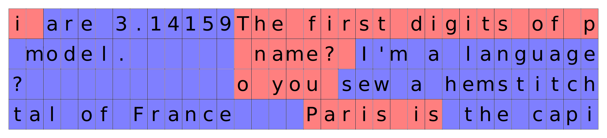
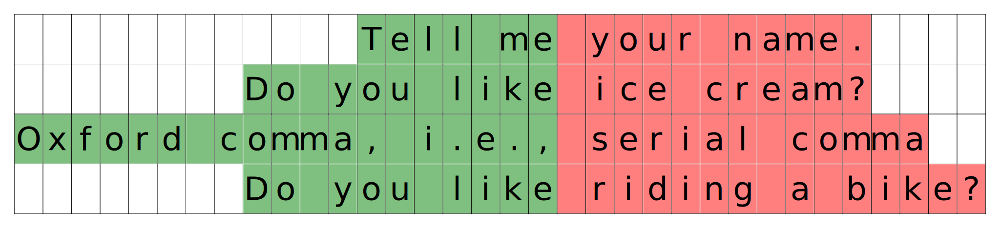
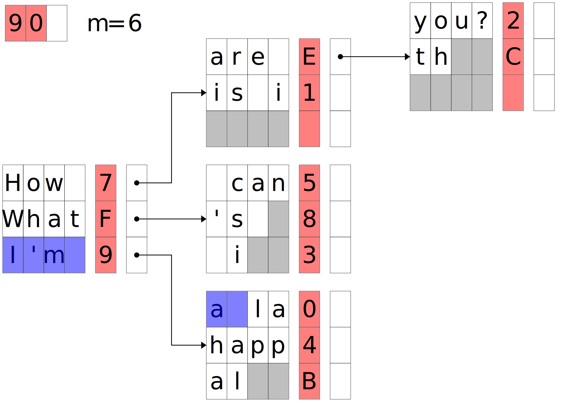

# Minimal Serving in JAX

## Introduction

This is a simple codebase for high-performance LLM serving in JAX, with a focus on

1. simple, idiomatic JAX code,
2. demonstrating the most important serving optimizations.

The implementation aims to be pure-Python (without custom C++ extensions) and to
be sequential, using an event loop that’s logically easy to trace instead of
decentralized communicating workers.

## Main Serving Ideas

The main ideas of LLM serving include:

* **KV cache management** between prefill and decode stages;
* **continuous batching** to avoid request delays and efficiently handle different length request; and
* **prefix caching** so long sequences seen before can be cached instead of recomputed.

## Background

To generate from an LLM, we essentially want to generate a `response` sequence
given a `prompt` prefix sequence. These sequences are arrays, but for pseudocode
imagine we're given a `prompt: list[Token]` and we want to generate a `response:
list[Token]`. Generation proceeds iteratively, one token at a time, and each
token is a function of the whole sequence so far. In pseudocode:

```py
# A naive implementation, with no caching or batching
response = [generate_token_from_model(prompt)]
while response[-1] != END:
  response.append(generate_token_from_model(prompt + response))
```

where `generate_token_from_model` applies the model to the sequence:

```py
# A naive implementation, with no caching or batching
def generate_token_from_model(prompt_and_response):
  state = init_state()
  for token in prompt_and_response:
    logits, state = next_state(state, token)
  return token_from_logits(logits)
```

Implemented this way, we're redoing a lot of work: on each call to
`generate_token_from_model(prompt + response)`, we're recomputing the state from
`prompt + response[:-1]`. To avoid that recomputation, we inline our
implementation of `generate_token_from_model` and hoist redundant work out of
the loop and reuse `next_state` computations:

```py
# Prefill: compute state for `prompt`, up to when we start generating `response`
# (still no batching)
state = init_state()
for token in prompt:
  _, state = next_state(state, token)

# Decode: alternate state updates and response token generation
response = [token_from_logits(logits(state))]
while response[-1] != END:
  logits, state = next_state(state, response[-1])
  response.append(token_from_logits(logits))
```

The code naturally splits into two phases: *prefill* where we populate the
`state` cache for all the entries in `prompt`, and *decode* where we iteratively
generate updated state and response tokens.

Computing the state for many tokens at once can be batched as one call to the
model, so we can replace the prefill loop over tokens:

```py
# Prefill: compute state for `prompt`, up to when we start generating `response`
state = batched_compute_states(prompt)

# Decode: alternate state updates and response token generation
response = [token_from_logits(logits(state))]
while response[-1] != END:
  logits, state = next_state(state, response[-1])
  response.append(token_from_logits(logits))
```

These two phases have different arithmetic intensities and, when we're trying to
serve multiple different requests at a time, can be batched and optimized
differently.

To sort out those optimizations, let's first look in more detail at state
caching for Transformers.

### KV Cache

Transformer LLMs consist of roughly two types of operations: matrix
multiplication (in linear layers) and self-attention. While linear layers
process tokens independently, attention layers introduce a data dependency
between tokens in a sequence. Thus it's the attention layers for which state
caching is relevant.

The self-attention formula is:

```py
softmax(Q @ K.T, axis=-1) @ V  (1)
```

$$
\text{softmax}\left(Q K^T \right) V ~~~~~ (1)
$$

where `Q` is of shape `bf16[S, E]` and `K`, `V` are of shape `bf16[S, E]` giving
the shape formula:

```py
softmax(bf16[S, E] @ bf16[E, S], axis=-1) @ bf16[S, E]
```

where `S` stands for sequence length and `E` stands for embedding size.
Implicitly, the $i^\text{th}$ row of each of the matrices `Q`, `K`, and `V` is a
function of xi, where xi is the $i^\text{th}$ row of input to the attention
block. That is, each row of `Q`, `K`, and `V` can be calculated independently,
so all the cross-token dependence is encapsulated in the formula (1).

To determine the `state` we must carry, let's say we just want to add one more
row onto the output, for a new input of $x_{S+1}$. Partition (1) into block
matrices like

```py
softmax([Q; q] @ [K.T, k.T], axis=-1) @ [V; v]
```
or

$$
\text{softmax}\left(
	\begin{bmatrix} Q \\\ q \end{bmatrix}
	\begin{bmatrix} K^T & k^T \end{bmatrix}
\right)
\begin{bmatrix} V \\\ v \end{bmatrix}
$$

where `q`, `k`, and `v` are row vectors of shape `bf16[1, E]` that depend only
on $x_{S+1}$, while `[X; x] = jnp.vstack([X, x])` and
`[X, x] = jnp.hstack([X, x])` denote vertical and horizontal concatenation
respectively.

Notice that the last row of the result doesn't depend on `Q` at all. Instead we
just need

```py
softmax(q @ [K.T, k.T], axis=-1) @ [V; v]  (2)
```

or

$$
\text{softmax}\left(
	q
	\begin{bmatrix} K^T & k^T \end{bmatrix}
\right)
\begin{bmatrix} V \\\ v \end{bmatrix} ~~~~~ (2)
$$

Because `K` and `V` are functions of $x_{1:S}$ and not $x_{S+1}$, we can cache
them and only need to compute the `q`, `k`, and `v` vectors to be able to
evaluate this expression. These cached `K` and `V` matrices are the `state` we
carry across iterations. Saving and managing `K` & `V` is KV cache management.

In the prefill stage, all tokens come in at the same time, so we can compute the
full `K` and `V` matrices for each layer in a single batched forward pass. That
is, to implement `batched_compute_states` from the pseudocode, the linear layers
can be batched as in any neural network, and for attention layers we evaluate
expressions like (1) with `S >> 1`. That means lots of batch parallelism is
available.

However, in the decode phase, generating token `T+1` depends on what we
generated for token `T`. The typical approach is to generate tokens one by one
auto-regressively, evaluating expressions like (2) using (and updating) cached
`K` and `V` matrices corresponding to the `next_state` calls in the pseudocode.
(Alternative approaches include guessing a short continuation and then verifying
it, like in *speculative decoding*, or using iterative methods to converge an
initial guess solution, like in text diffusion models. We don't cover those
here.) As a result, the decode phase has no batch parallelism available across
the tokens in a single sequence, and we need to look for batch parallelism
elsewhere.

### Continuous Batching

An LLM server has to handle many requests, and that gives us an opportunity for
batch parallelism across sequences in the decode phase. And batching is crucial
for cost effectiveness: with modern accelerators the cost of processing every
decoding step (to produce a single token) is limited by their VRAM speed (the
accelerator has to read in the entire model for every step). To a first order
approximation, processing 16 decode calls at once takes about as long as
processing a single one. (Prefill, which involves processing an entire sequence
for a single request, is often compute-bound, so it scales linearly with a batch
of requests – processing two sequences takes around 2x as long as processing a
single one. So prefill can be batched across sequences, but doesn't have to be.)

But a potential downside to batching across requests is increased latency. If we
were to form a batch by waiting until N requests arrive, some unlucky requests
might experience a lot of latency.

Instead of waiting, a better method is to slice new requests into an ongoing
decode state (the decode cache + the current tokens):

<div align="center">

<br>
Fig: Decoding with continuous batching.
</div>

This technique is called *continuous batching*. Requests are first prefilled one
by one, then the decode state produced is passed to the decoding function that
slices the decode state into the continuous decode batch and runs a decoding
step (or a few) from both the existing and newly sliced-in requests.

### Disaggregated vs Interleaved Serving

Processing a single request requires prefilling it and then decoding. Should we
have our chips alternate between these two steps, or should we dedicate some
chips to prefill and others to decode?

The alternating strategy is called *interleaved serving*. An advantage is that
it always keeps the accelerator busy. But it also reduces the apparent decoding
speed (when decoding is paused for prefill) and increases the latency to first
output token (when prefill has to wait for decoding of existing sequences).
Additionally, the optimal weights sharding (how they’re split between
accelerator chips) might differ between prefill and decode.

In contrast, *disaggregated serving* allocates a subset of chips to prefill and
the remaining chips to decode. This approach reduces latency, but requires
moving the decode state produced by the prefill chips to the decode chips. In
practice, that communication can happen entirely asynchronously from the
computation, so it’s often fully hidden. The downsides of disaggregate serving
is that if the amount of prefill work required (measured by wall clock time) is
smaller than the decode work, the prefill chips sit idle a lot of the time – and
vice versa. Even if the typical fraction of prefill vs decode work is well
known, it might vary across time.

#### Scheduling

Because the decode computation is a consumer of prefill results, and the prefill
computation is a consumer of server requests (and is idle without them), a lot
of LLM serving frameworks opt for a fully asynchronous implementation. This
codebase uses a simpler approach of an event loop:

```py
while True:
	serving.prefill_step()
	serving.decode_step()
```

Here we rely on JAX's asynchronous dispatch of computation, rather than
introducing explicit threads of our own. The decode step dispatch will not wait
for the prefill step to be fully done, fully overlapping the dispatch time. The
challenge of this approach is making time for additional host work like checking
on any new requests or sending off the completed ones. In practice, we aim for
dispatch to be much faster than the computation itself, allowing that host work
to also be fully overlapped.

### Prefix Caching

It’s possible that a lot of requests are repeated, at least in part. Retrieving
the even partially matched decode state from memory instead of recomputing it
allows either skipping prefill entirely or computing a shorter incremental
prefill sequence instead. Because of the causal constraint, a match only counts
if it matches the exact token sequence from the first token up to some point.
The first difference terminates the match. For prefill, long matches can be very
common because the serving specific system prompt can be extremely long – if
it’s prepended to the request it counts as a very long match. Chats also result
in long matches, if the chat is re-sent as a new request every new turn. For
long decoding sequences (two people asking for the history of the world) matches
are less likely because the next-token sampler used is seldom deterministic, so
the same request generates different answer paths.

<div align="center">

<br>
Fig: Prefill with partial prefix cache matches.
</div>

The simplest strategy for storing the decode state requires storing the KV cache
for an entire sequence. When stored sequences themselves overlap a lot, this can
be very memory inefficient. One possible workaround is using a trie data
structure. In practice storing each token separately in a trie would result in a
large number of small separate buffers, so a chunked trie is a good alternative.
Where we key each edge with a sequence chunk.

<div align="center">

<br>
Fig: Each node in the trie contains: (a) the sequence key “How “, (b) the chunk
buffer pointer (7), (c) a pointer to the next node (“are ” / “is i”). The
animation matches “I’m a “ – a partial match.
</div>

<p align="center">
</p>

The prefix cache trie retrieval and insertion is done on the host and can
potentially stall the accelerator computation dispatch. We use a combination of
simple numpy and array hashing (in numpy as well) to speed up retrieval
(especially at the root, which has the highest number of different sequence
keys).

#### Memory Offloading

Accelerator memory is the fastest to retrieve, but its capacity is limited. We
can [offload](https://docs.jax.dev/en/latest/notebooks/host-offloading.html) the
least used buffers to CPU memory. Prefill can sometimes be faster than KV cache
retrieval from host memory, but we don’t introduce this optimization. We can
increment the node counter for each node in the trie (on traversal, retrieval or
insertion) to mark which buffers are least used and offload those first.

#### Prefix cache pruning

Finally, to limit the total size of the prefix cache in host memory (after
offloading), we can drop the least visited nodes in the prefix cache trie. This
requires freeing buffers and can be costly, a balance between new buffer
generation and buffer deletion is adjustable via the sequence chunk size (fewer
larger buffers).

### The Event Loop

We expand the event loop

```py
while True:
	serving.prefill_step()
	serving.decode_step()
```

to the final version:

```py
while True:
	# prefill step
	get the prefill buffer
	for every new request (until pending decode queue is large enough):
       	retrieve existing prefix match (potentially nothing) from the prefix cache
		insert the match into the prefill buffer
	prefill the request in the prefill buffer
	retrieve the prefilled requests and place them in the decode queue (send buffers)
	# decode step
	for every pending decode work (a prefilled KV cache and current token):
		if there is space in the decode buffer:
			insert pending decode work into the decode continuous batch buffer
		else:
			break
	decode for N steps
	for every entry in the decode continuous batching buffer:
		if entry is done decode (EOS reached, max decode sequence):
			return done request
			remove from decode buffer
			emplace in the prefix cache
	# prefix cache management
	offload buffers in the prefix cache to host if necessary
	delete buffers in the prefix cache if necessary
```

## Extensions and Future Work

1. Different KV cache implementations – paged KV cache attention is often used
instead of regular attention since it allows for storing sequences highly varied
in length (as opposed to a single rectangular buffer for the cache). This is a
significant advantage, but the paged layout of memory can be slower for shorter
sequences and often requires accelerator specific attention implementations,so
the codebase is less portable between accelerators.

2. Combined prefill decode – since it’s possible to chunk prefill into segments
of arbitrary length, it’s possible to have only a single worker which combines
short prefill chunks and decode token work in the same batch to optimally
balance decode and prefill throughput.

<p align="center" style="font-weight: bold">
🚨 If you're into serving with JAX, please contribute back by opening issues and
PRs! 🚨
</p>
